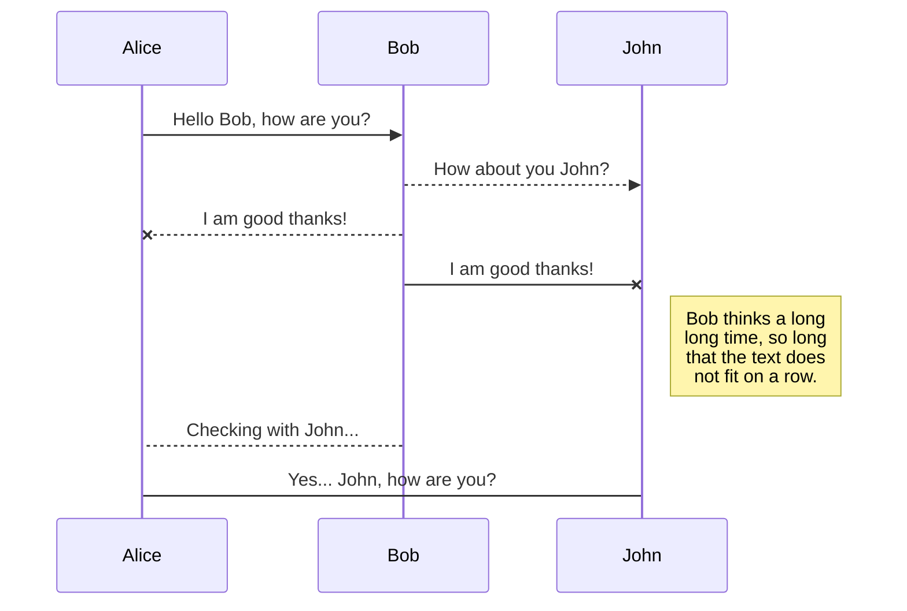
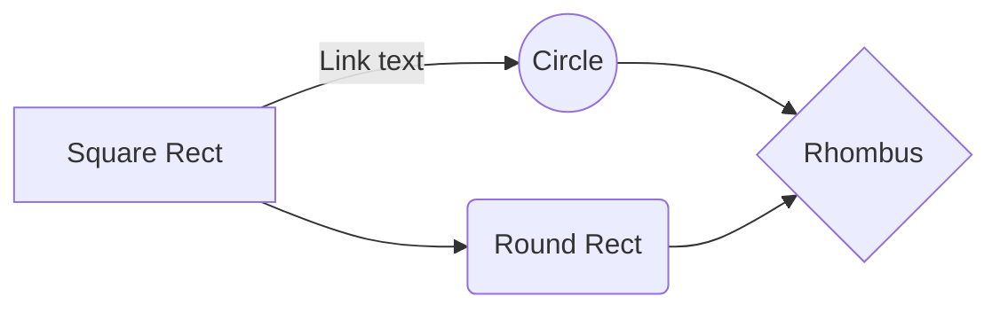

# [001] 소프트웨어 생명 주기

**1. 소프트웨어 생명 주기(Software Life Cycle)**
- 소프트웨어 개발 방법론의 바탕
- 소프트웨어를 개발하기 위해 정의하고 운용, 유지보수 등의 과정을
각 단계별로 나눈 것이다.
	- 소프트웨 개발 단계와 각 단계별 주요 활동, 활동의 결과에 대한 산출물로 표현
	- **소프트웨어 생명 주기 모형**
		> 소프트웨어 생명 주기를 표현하는 형태
		> 개발자는 문제의 유형이나 개발 방법 등에 따라 특정 모형을 선택하여 사용할 수 있고, 개별적인 모형을 사용할 수도 있다.
	- 생명 주기 모형의 종류
  1. **폭포수 모형(Waterfall Model)**
    - 각 단계를 확실히 매듭짓고, 다음 단계를 진행하는 개발 방법론
      - **선형 순차적 모형**
      - **메뉴얼 작성**
      - 두 개 이상의 과정이 병행하여 수행되지 않음
        > 타당성 검토 -> 계획 -> 요구 분석 -> 설계 -> 구현(코딩) -> 시험(검사) -> 유지보수
  2. **프로토타입 모형(Prototype Model)**
    - 실제 개발될 소프트웨어에 대한 견본(시제)품(Prototype)을 만들어 최종 결과물을 예측
      - 사용자와 시스템 사이의 인터페이스에 중점을 두어 개발
      - 시스템의 일부 / 시스템의 모형을 만드는 과정
        > 추후 구현 단계에서 사용될 골격 코드가 됨
      - 개발 완료 시점에서 오류가 발견되는 폭포수 모형을 보완하는 모형
        >
	3. 나선형 모형(Spiral Model, 점진적 모형)
		- 보헴(Boehm)이 제안한 것으로, 위험 분석 기능을 추가한 모형
		- 여러 번의 소프트웨어 개발 과정을 거쳐 개발 -> 점진적 모형
		- 개발 시 발생하는 위험을 관리하고 최소화
		- 누락되거나 추가된 요구사항을 첨가할 수 있음
		- 유지보수 과정이 필요 없음
	4. 애자일 모형(Agile Model)
		- 일정한 주기를 반복하여 개발과정을 진행
			> 스프린트(Sprint), 이터레이션(Iteration)
		- 고객과의 소통에 초점을 맞춤
		- 어느 특정 개발 방법론이 아님
		- **소규모 프로젝트, 숙련 개발자, 급변하는 요구사항**에 적합
			> 스크럼, XP, 칸반, Lean, 크리스탈, ASD, FDD, DSDM, DAD ...
		- 애자일 4대 원칙
			1)) 프로세스, 도구 < **개인, 상호작용**
			2)) 방대한 문서 < **실행되는 SW**
			3)) 계약 협상 < **고객과 협업**
			4)) 계획 < **변화**
	5. 폭포수 vs 애자일

|구분  |폭포수 모형  |애자일 모형  |
|--|--|--|
|새로운 요구사항 반영  |어려움  |지속적으로 반영  |
|고객과의 의사소통  |적음  |지속적임  |
|테스트  |마지막에 모든 기능을 테스트  |반복되는 일정 주기가 끝날 때마다 테스트  |
|개발 중심  |계획, 문서(메뉴얼)  |고객  |

# Files

StackEdit stores your files in your browser, which means all your files are automatically saved locally and are accessible **offline!**

## Create files and folders

The file explorer is accessible using the button in left corner of the navigation bar. You can create a new file by clicking the **New file** button in the file explorer. You can also create folders by clicking the **New folder** button.

## Switch to another file

All your files and folders are presented as a tree in the file explorer. You can switch from one to another by clicking a file in the tree.

## Rename a file

You can rename the current file by clicking the file name in the navigation bar or by clicking the **Rename** button in the file explorer.

## Delete a file

You can delete the current file by clicking the **Remove** button in the file explorer. The file will be moved into the **Trash** folder and automatically deleted after 7 days of inactivity.

## Export a file

You can export the current file by clicking **Export to disk** in the menu. You can choose to export the file as plain Markdown, as HTML using a Handlebars template or as a PDF.

# Synchronization

Synchronization is one of the biggest features of StackEdit. It enables you to synchronize any file in your workspace with other files stored in your **Google Drive**, your **Dropbox** and your **GitHub** accounts. This allows you to keep writing on other devices, collaborate with people you share the file with, integrate easily into your workflow... The synchronization mechanism takes place every minute in the background, downloading, merging, and uploading file modifications.

There are two types of synchronization and they can complement each other:

- The workspace synchronization will sync all your files, folders and settings automatically. This will allow you to fetch your workspace on any other device.
	> To start syncing your workspace, just sign in with Google in the menu.

- The file synchronization will keep one file of the workspace synced with one or multiple files in **Google Drive**, **Dropbox** or **GitHub**.
	> Before starting to sync files, you must link an account in the **Synchronize** sub-menu.

## Open a file

You can open a file from **Google Drive**, **Dropbox** or **GitHub** by opening the **Synchronize** sub-menu and clicking **Open from**. Once opened in the workspace, any modification in the file will be automatically synced.

## Save a file

You can save any file of the workspace to **Google Drive**, **Dropbox** or **GitHub** by opening the **Synchronize** sub-menu and clicking **Save on**. Even if a file in the workspace is already synced, you can save it to another location. StackEdit can sync one file with multiple locations and accounts.

## Synchronize a file

Once your file is linked to a synchronized location, StackEdit will periodically synchronize it by downloading/uploading any modification. A merge will be performed if necessary and conflicts will be resolved.

If you just have modified your file and you want to force syncing, click the **Synchronize now** button in the navigation bar.

> **Note:** The **Synchronize now** button is disabled if you have no file to synchronize.

## Manage file synchronization

Since one file can be synced with multiple locations, you can list and manage synchronized locations by clicking **File synchronization** in the **Synchronize** sub-menu. This allows you to list and remove synchronized locations that are linked to your file.

# Publication

Publishing in StackEdit makes it simple for you to publish online your files. Once you're happy with a file, you can publish it to different hosting platforms like **Blogger**, **Dropbox**, **Gist**, **GitHub**, **Google Drive**, **WordPress** and **Zendesk**. With [Handlebars templates](http://handlebarsjs.com/), you have full control over what you export.

> Before starting to publish, you must link an account in the **Publish** sub-menu.

## Publish a File

You can publish your file by opening the **Publish** sub-menu and by clicking **Publish to**. For some locations, you can choose between the following formats:

- Markdown: publish the Markdown text on a website that can interpret it (**GitHub** for instance),
- HTML: publish the file converted to HTML via a Handlebars template (on a blog for example).

## Update a publication

After publishing, StackEdit keeps your file linked to that publication which makes it easy for you to re-publish it. Once you have modified your file and you want to update your publication, click on the **Publish now** button in the navigation bar.

> **Note:** The **Publish now** button is disabled if your file has not been published yet.

## Manage file publication

Since one file can be published to multiple locations, you can list and manage publish locations by clicking **File publication** in the **Publish** sub-menu. This allows you to list and remove publication locations that are linked to your file.

# Markdown extensions

StackEdit extends the standard Markdown syntax by adding extra **Markdown extensions**, providing you with some nice features.

> **ProTip:** You can disable any **Markdown extension** in the **File properties** dialog.

## SmartyPants

SmartyPants converts ASCII punctuation characters into "smart" typographic punctuation HTML entities. For example:

|                |ASCII                          |HTML                         |
|----------------|-------------------------------|-----------------------------|
|Single backticks|`'Isn't this fun?'`            |'Isn't this fun?'            |
|Quotes          |`"Isn't this fun?"`            |"Isn't this fun?"            |
|Dashes          |`-- is en-dash, --- is em-dash`|-- is en-dash, --- is em-dash|

## KaTeX

You can render LaTeX mathematical expressions using [KaTeX](https://khan.github.io/KaTeX/):

The *Gamma function* satisfying $\Gamma(n) = (n-1)!\quad\forall n\in\mathbb N$ is via the Euler integral

$$
\Gamma(z) = \int_0^\infty t^{z-1}e^{-t}dt\,.
$$

> You can find more information about **LaTeX** mathematical expressions [here](http://meta.math.stackexchange.com/questions/5020/mathjax-basic-tutorial-and-quick-reference).

## UML diagrams

You can render UML diagrams using [Mermaid](https://mermaidjs.github.io/). For example, this will produce a sequence diagram:

And this will produce a flow chart:

